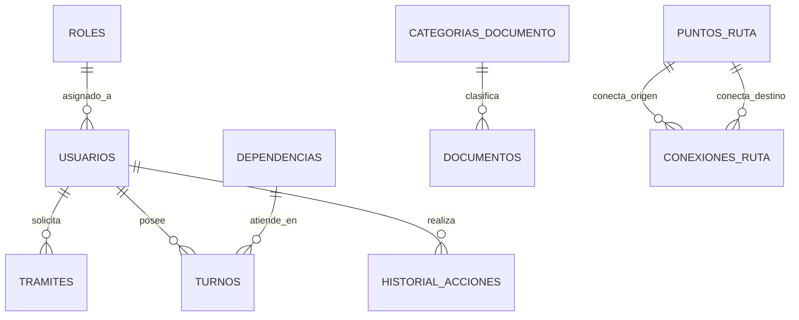

# 🏛️ PROYECTO INTEGRADOR: SMARTCAMPUS UTA WEB
## DOCUMENTACIÓN TÉCNICA OFICIAL Y MANUAL DE DESARROLLO

Esta documentación académica ha sido estructurada siguiendo de manera estricta las directrices de la **Universidad Técnica de Ambato (UTA)** para proyectos de la asignatura de **Estructuras de Datos** y **Modelamiento de Software**.

---

## 1. INTRODUCCIÓN Y ALCANCE DEL PROYECTO

### 1.1 Tema del Proyecto
Desarrollo de la plataforma **“SmartCampus UTA Web”**, una solución centralizada para la gestión de turnos de atención estudiantil, registro de trámites académicos, organización jerárquica de dependencias y navegación geolocalizada interna dentro del campus.

### 1.2 Objetivo General
Diseñar e implementar un aplicativo web robusto bajo una arquitectura de software organizada en capas, que integre persistencia en base de datos relacional y emplee **estructuras de datos dinámicas propias** para resolver la lógica operacional del campus.

### 1.3 Objetivos Específicos
*   Modelar los flujos operacionales y estructurar la base de datos relacional en base a la teoría de normalización.
*   Implementar clases propias en Python para las estructuras de datos lineales y no lineales sin usar dependencias externas.
*   Diseñar una interfaz web accesible, adaptativa y fluida bajo una identidad visual corporativa unificada en tonos dorado y carbón.
*   Bypassear el bloqueo de puertos de salida de Render utilizando una arquitectura orientada a servicios (API HTTP con Google Apps Script).

---

## 2. DISEÑO Y MODELADO DE LA BASE DE DATOS (REQUISITO 9)

El diseño de la base de datos asegura la integridad referencial y la trazabilidad de los procesos universitarios.

### 2.1 Modelo Entidad-Relación (MER)
A continuación se presenta la representación de relaciones entre las entidades principales del sistema:



### 2.2 Diccionario de Datos Oficial

#### Tabla 1: `roles`
Almacena los perfiles del sistema (Estudiante, Empleado, Administrador).
*   `id` (INT, PK, Auto_Increment): Identificador único de cada rol.
*   `nombre` (VARCHAR(50), Unique, Not Null): Nombre único del perfil.
*   `descripcion` (VARCHAR(200), Null): Descripción corta de permisos.

#### Tabla 2: `usuarios`
Almacena los datos personales de estudiantes y empleados verificados de la UTA.
*   `id` (INT, PK, Auto_Increment): Identificador único de usuario.
*   `email` (VARCHAR(120), Unique, Not Null, Index): Correo electrónico institucional.
*   `password_hash` (VARCHAR(256), Not Null): Hash seguro de la contraseña.
*   `nombres` (VARCHAR(100), Not Null): Nombres del usuario.
*   `apellidos` (VARCHAR(100), Not Null): Apellidos del usuario.
*   `cedula` (VARCHAR(20), Unique, Not Null): Cédula de identidad.
*   `tipo_usuario` (ENUM('estudiante', 'empleado', 'admin'), Default 'estudiante'): Clasificación del usuario.
*   `rol_id` (INT, FK $\rightarrow$ `roles.id`, Null): Rol asignado.
*   `fecha_registro` (DATETIME, Default UTC): Fecha de creación de la cuenta.
*   `activo` (BOOLEAN, Default True): Indica si la cuenta está activa.
*   `email_verificado` (BOOLEAN, Default False): Estado de verificación de correo institucional.

#### Tabla 3: `tramites`
Registra las solicitudes académicas realizadas por los estudiantes.
*   `id` (INT, PK, Auto_Increment): Código único del trámite.
*   `usuario_id` (INT, FK $\rightarrow$ `usuarios.id`, Not Null): Estudiante que solicita.
*   `tipo_tramite` (VARCHAR(100), Not Null): Nombre del trámite (Certificados, Matrícula, etc.).
*   `estado` (ENUM('iniciado', 'en_revision', 'aprobado', 'rechazado'), Default 'iniciado'): Estado del flujo.
*   `fecha_inicio` (DATETIME, Default UTC): Fecha de inicio.
*   `fecha_actualizacion` (DATETIME, Default UTC): Fecha de última modificación.
*   `observaciones` (TEXT, Null): Comentarios de secretaría.

#### Tabla 4: `turnos`
Gestiona la fila virtual para atención estudiantil.
*   `id` (INT, PK, Auto_Increment): Identificador del turno.
*   `usuario_id` (INT, FK $\rightarrow$ `usuarios.id`, Not Null): Estudiante asignado.
*   `dependencia_id` (INT, FK $\rightarrow$ `dependencias.id`, Not Null): Ventanilla de atención.
*   `codigo_turno` (VARCHAR(20), Not Null): Código asignado (ej. F-001).
*   `estado` (ENUM('en_espera', 'atendido', 'cancelado'), Default 'en_espera'): Estado del turno.
*   `fecha_emision` (DATETIME, Default UTC): Fecha de creación.
*   `fecha_atencion` (DATETIME, Null): Fecha en que se atendió al estudiante.

#### Tabla 5: `dependencias`
Representa el organigrama universitario (Rectorado $\rightarrow$ Decanatos $\rightarrow$ Carreras).
*   `id` (INT, PK, Auto_Increment): Código de dependencia.
*   `nombre` (VARCHAR(150), Not Null): Nombre oficial de la entidad.
*   `dependencia_padre_id` (INT, FK $\rightarrow$ `dependencias.id`, Null): Relación recursiva (para modelar jerarquías de árbol).

#### Tabla 6: `categorias_documento` y `documentos`
Gestiona los repositorios de archivos.
*   `id` (INT, PK, Auto_Increment): Identificador.
*   `titulo` (VARCHAR(200), Not Null): Nombre del archivo.
*   `ruta_archivo` (VARCHAR(300), Not Null): Ubicación en disco/nube.
*   `categoria_id` (INT, FK $\rightarrow$ `categorias_documento.id`, Not Null): Clasificación.

#### Tabla 7: `puntos_ruta` y `conexiones_ruta`
Representación de puntos del mapa y conexiones físicas para el algoritmo de grafos.
*   `id` (INT, PK, Auto_Increment): Identificador del punto/caminería.
*   `punto_origen_id` (INT, FK $\rightarrow$ `puntos_ruta.id`, Not Null): Punto de salida.
*   `punto_destino_id` (INT, FK $\rightarrow$ `puntos_ruta.id`, Not Null): Punto de llegada.
*   `distancia_metros` (FLOAT, Not Null): Peso (distancia física).

### 2.3 Proceso de Normalización Aplicado
La base de datos fue normalizada para evitar redundancia y garantizar integridad:
*   **Primera Forma Normal (1FN):** Todos los atributos son atómicos (sin valores multivalorados o grupos repetitivos). Los campos de nombres y apellidos se separaron en `nombres` y `apellidos` independientes.
*   **Segunda Forma Normal (2FN):** Está en 1FN y todos los atributos no primos dependen de forma funcional completa de la clave primaria. Se eliminaron dependencias parciales aislando los catálogos en tablas específicas como `roles` y `categorias_documento`.
*   **Tercera Forma Normal (3FN):** Está en 2FN y no existen dependencias transitivas. Por ejemplo, los turnos dependen directamente del `usuario_id` y de la `dependencia_id`, pero no de los detalles del decanato, los cuales se resuelven a través de la relación jerárquica recursiva en la tabla `dependencias`.

---

## 3. ARQUITECTURA DE SOFTWARE (REQUISITO 10)

Se ha implementado una arquitectura organizada estrictamente en capas para separar la lógica de negocio del almacenamiento de datos.

```
┌─────────────────────────────────────────────────────────────┐
│ PRESENTACIÓN (Vistas HTML, CSS Premium Dorado/Carbón, JS)   │
└──────────────────────────────┬──────────────────────────────┘
                               ▼
┌─────────────────────────────────────────────────────────────┐
│ APLICACIÓN (Blueprints de Flask, Controladores, Rutas)       │
└──────────────────────────────┬──────────────────────────────┘
                               ▼
┌─────────────────────────────────────────────────────────────┐
│ DOMINIO (Modelos de Negocio, TDA Propios: Pilas, Grafos, etc)│
└──────────────────────────────┬──────────────────────────────┘
                               ▼
┌─────────────────────────────────────────────────────────────┐
│ PERSISTENCIA (SQLAlchemy ORM - Sesiones y Transacciones)     │
└──────────────────────────────┬──────────────────────────────┘
                               ▼
┌─────────────────────────────────────────────────────────────┐
│ DATOS (Base de datos relacional MySQL en Aiven)             │
└─────────────────────────────────────────────────────────────┘
```

*   **Aislamiento de la lógica:** Los algoritmos (como Dijkstra o las rotaciones circulares) se ejecutan puramente en la capa de **Dominio** utilizando memoria RAM local sobre los TDAs creados. La base de datos relacional actúa como repositorio persistente que inicializa estas estructuras al arrancar el servidor.

---

## 4. ANÁLISIS DE ESTRUCTURAS DE DATOS Y COMPLEJIDAD (REQUISITO 11)

Las estructuras de datos fueron implementadas a mano en `app/estructuras/basicas.py`.

### 4.1 Resumen de Complejidad Algorítmica (Big-O)

| Estructura | Operación Clave | Complejidad Peor Caso | Complejidad Mejor Caso | Aplicación Funcional en SmartCampus |
| :--- | :--- | :--- | :--- | :--- |
| **`ListaSimple`** | Inserción al final | $O(N)$ | $O(1)$ | Catálogo de tipos de trámites académicos. |
| **`ListaDoble`** | Inserción al final | $O(1)$ | $O(1)$ | Estructura interna de apoyo para Colas y Pilas. |
| **`ListaCircular`** | Rotación (`siguiente`) | $O(1)$ | $O(1)$ | Asignación secuencial de turnos en Ventanillas. |
| **`Pila`** | Desapilar (`desapilar`) | $O(N)$ (recorrido) | $O(1)$ | Bitácora de reversión y deshacer acciones. |
| **`Cola`** | Desencolar (`desencolar`) | $O(1)$ | $O(1)$ | Fila virtual para atención de ventanillas (FIFO). |
| **`ArbolNArio`** | Búsqueda (`buscar_nodo`) | $O(N)$ | $O(1)$ | Organigrama jerárquico Rectorado $\rightarrow$ Carrera. |
| **`Grafo`** | Dijkstra (`dijkstra`) | $O((V+E) \log V)$ | $O(1)$ | Cálculo de la ruta más corta en el campus. |

---

## 5. MANUAL DE INSTALACIÓN Y CONFIGURACIÓN (REQUISITO 12)

### 5.1 Requisitos Previos
*   Python 3.10 o superior instalado.
*   Acceso a internet (para sincronizar con Aiven y Google Apps Script).

### 5.2 Instalación en Entorno Local (Windows)
1.  **Clonar el repositorio:**
    ```bash
    git clone https://github.com/Steven9tp/Estructura-Datos-Web.git
    cd Estructura-Datos-Web
    ```
2.  **Crear y activar el entorno virtual:**
    ```bash
    python -m venv venv
    venv\Scripts\activate
    ```
3.  **Instalar dependencias necesarias:**
    ```bash
    pip install -r requirements.txt
    ```
4.  **Configurar base de datos inicial:**
    Ejecutar el script de inicialización para cargar las tablas y los registros iniciales en tu base de datos de Aiven:
    ```bash
    python reset_db.py
    ```
5.  **Ejecutar el servidor local:**
    ```bash
    python run.py
    ```
    El sistema estará disponible en `http://127.0.0.1:5000/`.

---

## 6. ARQUITECTURA DE DESPLIEGUE EN LA NUBE (DEVOPS)

El sistema se diseñó para ejecutarse de forma persistente y gratuita empleando una arquitectura híbrida en la nube:

1.  **Servidor Web (Render - Plan Free):** Acepta las peticiones de los estudiantes. Tiene configurada una variable de entorno `PYTHON_VERSION=3.10.0` y lee los parámetros de base de datos relacional.
2.  **Base de Datos Administrada (Aiven MySQL):** Base de datos relacional en la nube. Requiere conexión SSL automática implementada en `app/__init__.py`.
3.  **Puente de Correo Electrónico (Google Apps Script - API HTTP):** Evita el bloqueo de puertos de Render enviando las peticiones de correo por protocolo HTTPS en el puerto seguro `443`.

---

## 7. MANUAL DE USUARIO (PASO A PASO)

### 7.1 Acceso e Inicio de Sesión
*   **Inicio de sesión:** Los usuarios ingresan con sus credenciales institucionales. El administrador por defecto es `admin@uta.edu.ec` con contraseña `admin123`.
*   **Registro de Usuarios:** Los estudiantes se registran ingresando su cédula y correo de la universidad. Tras el registro, el sistema envía un correo de confirmación.

### 7.2 Ventanilla Virtual (Atención Estudiantil - Cola)
1.  El estudiante accede al menú "Atención por Turnos".
2.  Solicita un turno seleccionando el área requerida (ej. Secretaría de la Facultad).
3.  El sistema genera un código de turno único (ej. SEC-001) y lo encola en memoria en el TDA **Cola**.
4.  En la pantalla de administración, el personal de atención hace clic en "Atender Siguiente". La cola ejecuta un `.desencolar()` (FIFO) y muestra los datos del estudiante en pantalla.

### 7.3 Organigrama (Árbol N-Ario)
1.  En la pestaña de "Organigrama Institucional" se visualiza la jerarquía de la universidad.
2.  El sistema lee de la base de datos recursivamente y reconstruye el TDA **Árbol N-Ario** en memoria RAM.
3.  El usuario puede ver de forma interactiva la descendencia organizativa y buscar dependencias directamente en la jerarquía.

### 7.4 Mapa del Campus y Cálculo de Rutas (Grafo y Dijkstra)
1.  Dirígete a la sección "Mapa del Campus".
2.  Selecciona un edificio de origen (ej. Facultad de Sistemas) y uno de destino (ej. Biblioteca Central).
3.  Haz clic en "Calcular Ruta Óptima".
4.  El sistema carga los puntos y caminos de la base de datos, inicializa el TDA **Grafo**, ejecuta el algoritmo de **Dijkstra** en peor caso, y muestra en pantalla la ruta exacta nodo por nodo junto a la distancia total acumulada.
