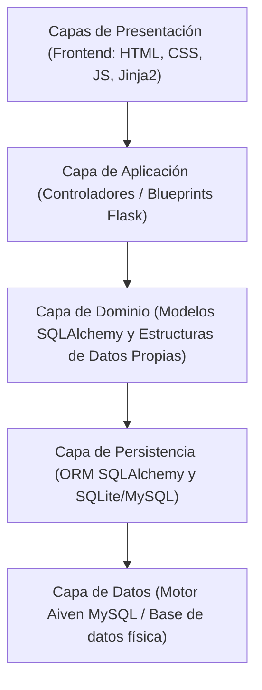

# INFORME DE DEFENSA Y EXPOSICIÓN
## PROYECTO: SmartCampus UTA Web

Este documento sirve como la guía oficial e informe técnico para la defensa oral del proyecto **SmartCampus UTA Web**. Ha sido estructurado de forma rigurosa y alineada al documento académico de requerimientos.

---

## 1. INTRODUCCIÓN Y JUSTIFICACIÓN DEL PROYECTO
El proyecto **SmartCampus UTA Web** es un sistema integrador diseñado para optimizar y centralizar los procesos de atención estudiantil, gestión de trámites, organización de dependencias jerárquicas y navegación de rutas dentro del campus de la **Universidad Técnica de Ambato (UTA)**.

A diferencia de los enfoques tradicionales que emplean librerías preconstruidas del lenguaje, este sistema destaca por la implementación de **estructuras de datos dinámicas propias**, garantizando que cada TDA (Tipo de Dato Abstracto) tenga una aplicación justificada en los casos de uso reales de la plataforma.

---

## 2. ARQUITECTURA DE SOFTWARE POR CAPAS
El sistema se organiza bajo una arquitectura limpia por capas para aislar responsabilidades y facilitar el mantenimiento del software:



### Detalle de las Capas:
1. **Capa de Presentación (Frontend):** Vistas dinámicas en HTML, estilizadas con CSS plano premium (paleta dorado/carbón de la UTA) y renderizadas mediante el motor de plantillas **Jinja2**.
2. **Capa de Aplicación (Lógica del Servidor):** Rutas y controladores Flask organizados en módulos independientes (Blueprints) como `/auth`, `/tramites`, `/atencion` y `/campus`.
3. **Capa de Dominio (Modelos y TDA):** Contiene la lógica del negocio, las clases de la base de datos (`Usuario`, `Tramite`, `NodoRuta`, etc.) y las **estructuras de datos personalizadas** (Listas, Colas, Pilas, Árboles, Grafos).
4. **Capa de Persistencia y Datos:** La persistencia se realiza mediante el ORM **SQLAlchemy** que traduce las operaciones a SQL relacional con integridad referencial sobre **MySQL (Aiven)**.

---

## 3. RELACIÓN Y MAPEO DE LAS ESTRUCTURAS DE DATOS

A continuación se detalla por qué se usó, cómo funciona y en qué archivo exacto se encuentra la implementación de cada una de las estructuras de datos propias del proyecto:

### 1. Las Listas (`ListaSimple`, `ListaDoble`, `ListaCircular`)
*   **¿Por qué se usó?**: Se usan para el almacenamiento secuencial dinámico. Como los datos académicos (como tipos de trámites o historial de auditoría) cambian constantemente, usar arreglos estáticos desperdiciaría memoria o limitaría el espacio.
*   **¿Cómo funciona?**: Enlazan nodos mediante punteros en memoria RAM. La `ListaSimple` apunta al siguiente nodo, la `ListaDoble` tiene doble puntero (siguiente y anterior) para navegar en ambas direcciones, y la `ListaCircular` conecta el último nodo con el primero para dar vueltas cíclicas infinitas.
*   **¿Dónde está en el código?**: 
    *   **Implementación:** Definidas a mano en [app/estructuras/basicas.py](file:///c:/Users/Administrador/Desktop/APP%20estrctura%20de%20datos%20Proyecto%20-%20copia/app/estructuras/basicas.py#L9-L135).

### 2. La Cola (`Cola` - FIFO)
*   **¿Por qué se usó?**: Para el módulo de **atención estudiantil y turnos de ventanilla**. Mapea el flujo físico de personas de manera 100% equitativa.
*   **¿Cómo funciona?**: Sigue la regla FIFO (*First-In, First-Out*): el primer estudiante en encolarse es el primero en ser llamado y atendido. Su tiempo de ejecución para insertar (`encolar`) y retirar (`desencolar`) es de $O(1)$ constante.
*   **¿Dónde está en el código?**:
    *   **Implementación:** En [app/estructuras/basicas.py](file:///c:/Users/Administrador/Desktop/APP%20estrctura%20de%20datos%20Proyecto%20-%20copia/app/estructuras/basicas.py#L162-L177).
    *   **Uso en la lógica:** En [app/atencion/routes.py](file:///c:/Users/Administrador/Desktop/APP%20estrctura%20de%20datos%20Proyecto%20-%20copia/app/atencion/routes.py#L15-L22) (donde se definen las colas por dependencia y se gestionan las ventanillas).

### 3. La Pila (`Pila` - LIFO)
*   **¿Por qué se usó?**: Para registrar el **historial de acciones y bitácora de trámites** del usuario, permitiendo rastrear sus movimientos y revertirlos.
*   **¿Cómo funciona?**: Sigue la regla LIFO (*Last-In, First-Out*): la última acción registrada es la primera que se puede visualizar o "deshacer" (como una pila de platos).
*   **¿Dónde está en el código?**:
    *   **Implementación:** En [app/estructuras/basicas.py](file:///c:/Users/Administrador/Desktop/APP%20estrctura%20de%20datos%20Proyecto%20-%20copia/app/estructuras/basicas.py#L140-L157).
    *   **Uso en la lógica:** En [app/tramites/routes.py](file:///c:/Users/Administrador/Desktop/APP%20estrctura%20de%20datos%20Proyecto%20-%20copia/app/tramites/routes.py#L40-L60) (donde se alimenta la bitácora de acciones del usuario).

### 4. El Árbol N-Ario (`ArbolNArio`)
*   **¿Por qué se usó?**: Para modelar el **organigrama institucional** de dependencias de la universidad (Rectorado $\rightarrow$ Facultades $\rightarrow$ Carreras).
*   **¿Cómo funciona?**: Es un árbol jerárquico no lineal donde cada nodo representa una oficina o departamento y puede tener múltiples nodos hijos vinculados. Se recorre de forma recursiva.
*   **¿Dónde está en el código?**:
    *   **Implementación:** En [app/estructuras/basicas.py](file:///c:/Users/Administrador/Desktop/APP%20estrctura%20de%20datos%20Proyecto%20-%20copia/app/estructuras/basicas.py#L182-L245).
    *   **Uso en la lógica:** En [app/organizacion/routes.py](file:///c:/Users/Administrador/Desktop/APP%20estrctura%20de%20datos%20Proyecto%20-%20copia/app/organizacion/routes.py#L18-L45) (donde se carga el árbol organizacional y se calcula su profundidad/altura).

### 5. El Grafo (`Grafo`)
*   **¿Por qué se usó?**: Para el **mapa físico de caminerías y edificios** de la universidad, permitiendo calcular la ruta óptima de navegación.
*   **¿Cómo funciona?**: Los edificios son nodos (vértices) y las veredas son conexiones (aristas) con un valor en metros (peso). Se utiliza el algoritmo de **Dijkstra** para explorar las conexiones y encontrar el camino más rápido entre cualquier origen y destino.
*   **¿Dónde está en el código?**:
    *   **Implementación:** En [app/estructuras/basicas.py](file:///c:/Users/Administrador/Desktop/APP%20estrctura%20de%20datos%20Proyecto%20-%20copia/app/estructuras/basicas.py#L250-L300).
    *   **Uso en la lógica:** En [app/campus/routes.py](file:///c:/Users/Administrador/Desktop/APP%20estrctura%20de%20datos%20Proyecto%20-%20copia/app/campus/routes.py#L30-L55) (donde se reciben las coordenadas y se ejecuta Dijkstra para pintar la ruta en el mapa).

---

## 4. DETALLE TÉCNICO DE IMPLEMENTACIÓN DE ALGORITMOS

### A. Algoritmo de Dijkstra (Cálculo de Rutas)
Usa una cola de prioridad (`heapq`) para calcular la ruta más corta entre dos puntos del campus.
```python
def dijkstra(self, inicio, fin):
    distancias = {nodo: float('infinity') for nodo in self.nodos}
    distancias[inicio] = 0
    padres = {nodo: None for nodo in self.nodos}
    cola_prioridad = [(0, inicio)]
    # Búsqueda...
```
*   **Complejidad temporal:** $O((V + E) \log V)$ donde $V$ es el número de vértices (edificios) y $E$ es el número de aristas (conexiones).

### B. Búsqueda y Altura en Árbol N-Ario
Para renderizar el organigrama y buscar dependencias se usan algoritmos recursivos:
*   **Búsqueda Recursiva:** Busca un nodo recorriendo los hijos de forma recursiva.
*   **Altura del Árbol:** Determina el número máximo de niveles jerárquicos.

---

## 5. GUÍA DE RESPUESTAS PARA LA DEFENSA (PREGUNTAS DEL TRIBUNAL)

> [!IMPORTANT]
> Estudia este banco de preguntas basadas en la rúbrica oficial del proyecto para responder con seguridad al tribunal.

### P1: ¿Por qué eligieron una cola para el módulo de atención y no otra estructura?
*   **Respuesta:** "Porque el módulo de atención estudiantil modela una fila de espera virtual que debe cumplir con el principio de equidad **FIFO** (*First-In, First-Out*): el primer estudiante en solicitar un turno debe ser el primero en ser atendido por el personal. Una cola implementada sobre una `ListaDoble` permite encolar en el extremo final y desencolar por el frente en tiempo constante $O(1)$ sin generar desfases en el orden."

### P2: ¿Qué ventaja ofrece la lista circular en la rotación de ventanillas o responsables?
*   **Respuesta:** "La lista circular conecta el último elemento con el primero. Esto nos permite implementar una distribución cíclica tipo **Round-Robin**. Al asignar un turno, el puntero avanza secuencialmente a la siguiente ventanilla disponible, y al llegar a la última ventanilla, retorna de manera automática a la primera ventanilla sin necesidad de condicionales complejos en la lógica de negocio."

### P3: ¿Cómo justifican el uso de un árbol en la clasificación documental o estructura organizacional?
*   **Respuesta:** "Las dependencias de la universidad tienen una naturaleza jerárquica natural de un solo origen (Rectorado $\rightarrow$ Decanatos $\rightarrow$ Direcciones de Carrera). Un Árbol N-Ario es la estructura óptima ya que representa relaciones de jerarquía exclusivas de tipo padre-hijo de manera natural, permitiendo calcular la profundidad de la organización y buscar dependencias mediante algoritmos recursivos."

### P4: ¿Qué representación del grafo usaron y por qué resultó apropiada para el campus?
*   **Respuesta:** "Representamos el grafo mediante una **Lista de Adyacencia** almacenada en un diccionario. Es la representación más eficiente para grafos dispersos (donde los edificios del campus no están todos conectados con todos entre sí), ya que optimiza el uso de memoria a diferencia de una matriz de adyacencia y facilita el recorrido del algoritmo de **Dijkstra** para encontrar la ruta más rápida."

### P5: ¿De qué manera la base de datos fue construida a partir de los requerimientos iniciales?
*   **Respuesta:** "El diseño de la base de datos partió de la separación clara de requerimientos. El módulo de usuarios (RF1, RF3) mapea a la tabla `usuarios`; el flujo de trámites (RF4, RF6) se almacena en `tramites`; el módulo de turnos (RF5) se mapea a `turnos`; y el mapa del campus (RF9, RF10) se alimenta de las tablas `puntos_ruta` y `conexiones_ruta`. Esto asegura que los datos sean persistentes y estructurados."

### P6: ¿Cómo solucionaron el bloqueo de envío de correos en Render?
*   **Respuesta:** "Las plataformas de alojamiento en la nube gratuitas como Render bloquean los puertos tradicionales de SMTP (465 y 587) para evitar spam, lo cual causa fallos de red (`[Errno 101] Network is unreachable`). Solucionamos esto implementando un puente HTTP. En lugar de usar sockets SMTP directo, nuestra aplicación hace una solicitud HTTP POST (puerto seguro 443, no bloqueado) a una API web desarrollada en **Google Apps Script** vinculada al correo del proyecto, la cual envía los correos reales de activación y recuperación utilizando la infraestructura nativa de Google."

---

## 6. CONCLUSIÓN
El sistema **SmartCampus UTA Web** demuestra la viabilidad de integrar conceptos académicos avanzados de estructuras de datos en una aplicación moderna del mundo real. A través del aislamiento de capas, el uso del ORM relacional para persistencia y el puente HTTP para el correo, el proyecto se presenta como una solución técnica estable, segura y óptima para su despliegue y defensa.
